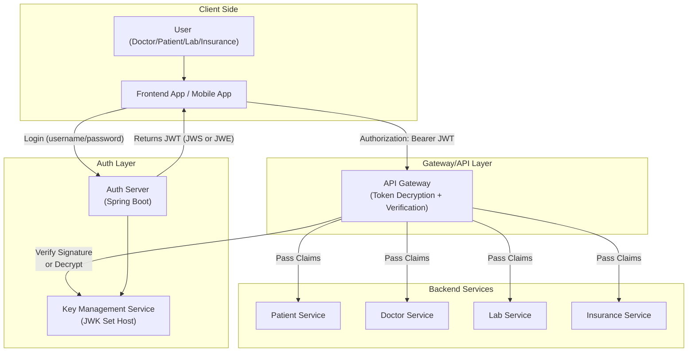

# Secure Multi-Tenant Healthcare Platform: Implementation Plan

## Problem Statement
We are building a multi-tenant digital healthcare platform for hospitals and diagnostic labs. The platform allows doctors, patients, and diagnostic labs to access sensitive medical records through APIs. 

**Requirements:**
- Protect medical records under HIPAA/GDPR
- Support multiple clients (hospitals/tenants)
- Allow secure third-party access (insurance companies)
- Ensure scalability, auditability, and prevent data leakage

## 🚧 Challenges We Must Solve
- **Sensitive Payload Protection:**
  - Medical history, lab results, and diagnosis reports must be encrypted end-to-end, even from the client app's storage or logs.
  - JWE is required here.
- **Token Integrity and Trust:**
  - All tokens must be verifiable by resource servers without hitting the Auth server each time.
  - Use asymmetric JWS (RS256) for signature verification across microservices.
- **Role-Specific Access Control:**
  - Doctors: full records
  - Patients: only personal reports
  - Labs: only update new test results
  - Insurance: only read encrypted summaries
- **Tenant Isolation:**
  - Each hospital operates in its own tenant space (isolated keys, separate data)
  - Token payloads must include tenant_id, and public keys must be resolved dynamically.
- **External Party Access with Limited Scope:**
  - Insurance companies: short-lived, read-only encrypted JWTs (JWE only, no write access)
  - No refresh tokens for them, only time-limited one-time JWTs.

## 🛠 What We Will Eventually Implement
- **Auth Server (Spring Boot):**
  - Authenticates user
  - Generates:
    - JWS-signed JWT for standard use
    - JWE-encrypted JWT for sensitive flows
- **Public Key Distribution Service:**
  - Host JWK Set (JSON Web Key Set) for all tenant public keys
- **API Gateway:**
  - Validates JWT signature
  - Decrypts encrypted tokens (JWE)
  - Extracts claims
  - Routes to correct service
- **Microservices:**
  - PatientService, DoctorService, LabService, InsuranceService
  - Perform role-based logic using JWT claims
- **Key Rotation Strategy:**
  - Periodically rotate keys per tenant
  - Invalidate tokens with old key IDs (kid in JWT header)
- **Audit Trail and Revoke/Blacklist Support:**
  - Audit all access from tokens (via jti)
  - Support blacklisting compromised tokens by ID

## Highlevel architecture

---

# Implementation Phases & Steps

## Phase 0: Prerequisites & Setup
- [ ] **0.1**: Design folder structure for all services:
  - `/auth-server/`, `/api-gateway/`, `/key-management/`, `/patient-service/`, `/doctor-service/`, `/lab-service/`, `/insurance-service/`, `/frontend-app/`
- [ ] **0.2**: Initialize each service as a separate Spring Boot project (or Node.js for KMS if preferred).
- [ ] **0.3**: Create a shared library for JWT/JWE/JWS utilities (optional, `/common-jwt-lib/`).
- [ ] **0.4**: Add a root-level `docker-compose.yml` for local orchestration.
- [ ] **0.5**: Create a root `README.md` with architecture diagram and service descriptions.

## Phase 1: Key Management Service (KMS)
- [ ] **1.1**: Create `/key-management/` Spring Boot/Node.js service.
- [ ] **1.2**: Implement REST endpoints:
  - `GET /.well-known/jwks.json` — returns JWK Set for all tenants (with tenant_id in key metadata)
  - `POST /admin/rotate-key` — rotates keys for a tenant (admin only)
  - `GET /jwk/{tenant_id}` — returns JWK Set for a specific tenant
- [ ] **1.3**: Store keys securely (in-memory for dev, HSM/secure vault for prod)
- [ ] **1.4**: Implement key versioning and `kid` (key ID) in JWKs
- [ ] **1.5**: Add README with API docs and usage examples

## Phase 2: Auth Server
- [ ] **2.1**: Create `/auth-server/` Spring Boot service
- [ ] **2.2**: Implement user authentication (username/password, in-memory or DB)
- [ ] **2.3**: On successful login:
  - Issue JWS-signed JWT (RS256) for standard flows
  - Issue JWE-encrypted JWT for sensitive flows (e.g., insurance access)
- [ ] **2.4**: Fetch tenant-specific signing/encryption keys from KMS
- [ ] **2.5**: Include `tenant_id`, `role`, `jti`, `kid`, and other claims in JWT payload
- [ ] **2.6**: Implement token blacklisting (in-memory for dev, persistent for prod)
- [ ] **2.7**: Add README with endpoints, JWT structure, and sample payloads

## Phase 3: Frontend App
- [ ] **3.1**: Create `/frontend-app/` (React/Angular/mobile)
- [ ] **3.2**: Implement login form (calls Auth Server `/login`)
- [ ] **3.3**: Store JWT securely (localStorage for web, secure storage for mobile)
- [ ] **3.4**: Attach JWT as Bearer token in API requests
- [ ] **3.5**: Add README with usage instructions and screenshots

## Phase 4: API Gateway
- [ ] **4.1**: Create `/api-gateway/` (Spring Boot/Node.js)
- [ ] **4.2**: Intercept all incoming requests, extract Bearer JWT
- [ ] **4.3**: Validate JWT signature (JWS) using tenant-specific public key from KMS
- [ ] **4.4**: Decrypt JWT (JWE) for sensitive flows using tenant-specific private key
- [ ] **4.5**: Extract claims (`tenant_id`, `role`, etc.) and inject into request context/headers
- [ ] **4.6**: Route requests to appropriate backend service based on claims and endpoint
- [ ] **4.7**: Add README with security flow and sample request/response

## Phase 5: Backend Services
- [ ] **5.1**: Create `/patient-service/`, `/doctor-service/`, `/lab-service/`, `/insurance-service/` (Spring Boot)
- [ ] **5.2**: Implement endpoints for each service:
  - Patient: view own records
  - Doctor: view/update patient records
  - Lab: update test results
  - Insurance: read-only access to encrypted summaries
- [ ] **5.3**: Trust API Gateway for authentication (no direct JWT validation)
- [ ] **5.4**: Enforce role-based access using claims from request context
- [ ] **5.5**: Add README for each service with API docs and sample flows

## Phase 6: Key Rotation & Blacklisting
- [ ] **6.1**: Implement scheduled key rotation in KMS (per tenant)
- [ ] **6.2**: Update Auth Server to use new keys and set `kid` in JWT header
- [ ] **6.3**: Invalidate tokens with old `kid` (blacklist or reject)
- [ ] **6.4**: Add admin endpoints for manual key rotation and blacklisting
- [ ] **6.5**: Document rotation and revocation flows in `/key-management/README.md`

## Phase 7: Audit Trail & Monitoring
- [ ] **7.1**: Log all token usage (by `jti`, `sub`, `tenant_id`, `role`) in each service
- [ ] **7.2**: Implement audit endpoints for querying access logs
- [ ] **7.3**: Add monitoring and alerting (Prometheus/Grafana or similar)
- [ ] **7.4**: Document audit and monitoring setup

## Phase 8: Integration & Testing
- [ ] **8.1**: Write integration tests for login, JWT issuance, and end-to-end flows
- [ ] **8.2**: Test key rotation, blacklisting, and audit logging
- [ ] **8.3**: Document test cases and results in `/tests/README.md`

---

# How to Use This Plan
- For each phase, copy the phase section as a prompt for implementation.
- Example:  
  > "Implement Phase 1: Key Management Service as described in the plan. Start with step 1.1 and proceed step by step."
- Iterate and refine each phase as needed.
